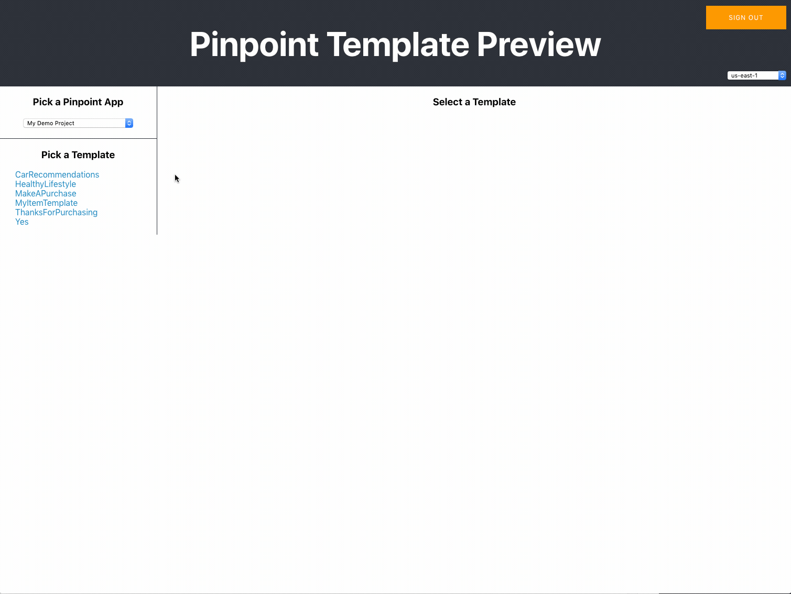

# Pinpoint Email Template Preview
The Pinpoint Email Template Preview is a web based application built with AWS Amplify Framework and React.  It can be installed into your AWS account by following the Setup instructions below and will allow you to preview what your templates will look like with different endpoints.  You can also view the Endpoint payload to view all User and Endpoint attributes.

## Demo


## Prerequisites

You need the following:

* An AWS account with sufficient permissions to create the resources shown in the diagram in the earlier section. For more information about creating an AWS account, see [How do I create and activate a new Amazon Web Services account?](https://aws.amazon.com/premiumsupport/knowledge-center/create-and-activate-aws-account/).
* An Amazon EC2 key pair. You need this to log into the EC2 instance if you want to modify the Twitter handle that you're monitoring. For more information, see [Creating a Key Pair Using Amazon EC2](https://docs.aws.amazon.com/AWSEC2/latest/UserGuide/ec2-key-pairs.html#having-ec2-create-your-key-pair).
* The AWS Command Line Interface (AWS CLI) installed and configured on your computer. For information about installing the AWS CLI, see [Installing the AWS Command Line Interface](https://docs.aws.amazon.com/cli/latest/userguide/installing.html). For information about setting up the AWS CLI, see [Configuring the AWS CLI](https://docs.aws.amazon.com/cli/latest/userguide/cli-chap-getting-started.html).

* NodeJS installed on your computer.

* AWS Amplify Framework Command Line Interface (CLI) installed and configured.
  ```
  $ npm install -g @aws-amplify/cli
  ```

## Setup
1. Run Amplify Initialize to setup the local and remote environments
```
$ amplify init
```

2. Add Hosting to the Amplify configuration to setup S3 and CloudFront
```
$ amplify add hosting
```
Then follow the configuration options.

3. Amplify push to update changes in your AWS account
```
$ amplify push
```

4. Run AWS CLI command to add users manually to the Cognito Pool to provide access to the web app.  You will need the User Pool ID created in the previous step.  Visit the Cognito User Pools Console at https://console.aws.amazon.com/cognito/users/.
```
$ aws cognito-idp admin-create-user --user-pool-id XXXX --username someemail@example.com
```
  Note - Ensure the username is a valid email address.  You will receive an email with a temporary password.

5. Install required node modules for the web app
```
$ npm install
```

6. Publish the App to S3
```
$ amplify publish
```
